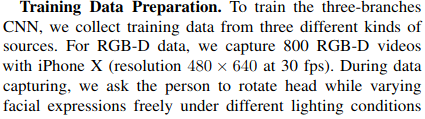
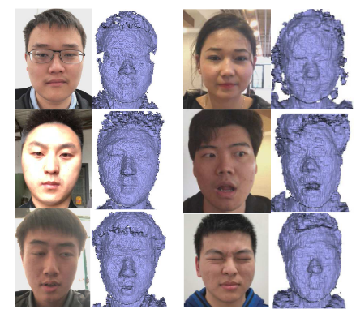
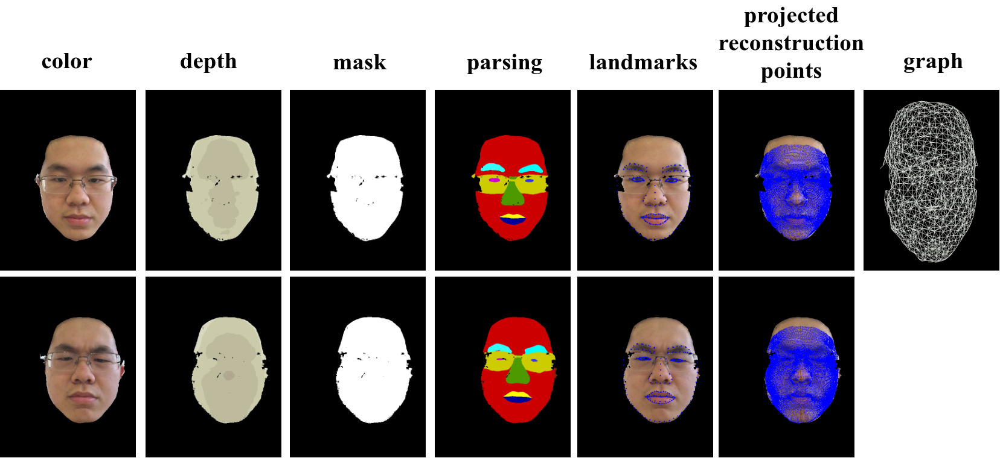
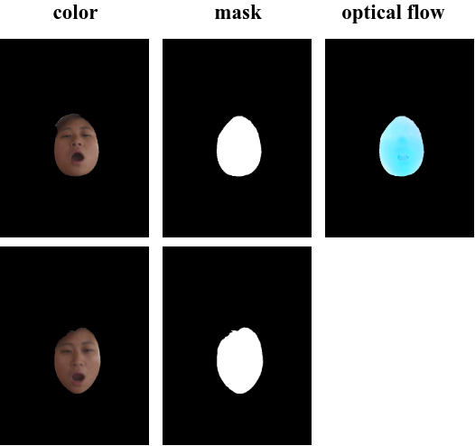

# 数据说明：
## 原始face rgbd数据（参考[face_RGBD.md](../face_RGBD.md)）
* 数据地址：
    - 原始数据iphoneX_face： [iphoneX_face](https://rec.ustc.edu.cn/share/470241b0-4adb-11ec-be86-05b7dc082786)

* 数据描述
    - 参考https://arxiv.org/pdf/1808.05323.pdf
    - 包含800段iPhoneX拍摄的面部视频。
    - 包含color 和 depth信息， 分辨率为480*640。
    - 相机内参：cx:240, oy:320, fx:593.7, fy:593.7。
    - 分别使用[FANFace](https://github.com/1adrianb/face-alignment)和商汤的人脸关键点检测器，得到每张人脸的68个关键点和240个关键点，保存为*_info.txt, *240info.txt。
 

* 数据可视化

* 存储格式
  example (two frames)

    - [root]iphoneX_face/iphoneX_revised/without_pts/20180422172211/0_color.jpg
    - [root]iphoneX_face/iphoneX_revised/without_pts/20180422172211/0_depth.png
    - [root]iphoneX_face/iphoneX_revised/without_pts/20180422172211/0_info.txt
    - [root]iphoneX_face/iphoneX_revised/without_pts/20180422172211/0_240info.txt

## FaceFlowData数据 （来自项目[NeuralFaceFlow]()）
* 数据地址：
    - FaceFlowData: [FaceFlowData](https://rec.ustc.edu.cn/share/8fc36a20-4adb-11ec-a834-fbd6aef9b05a)

* 数据描述
    - 本数据集在face rgbd数据集的基础上添加了face parsing, mask, deformation graph, 3D reconstruction points信息。对测试集，还添加了光流和场景流信息。

* 数据可视化
    - train/val data 

    - test data 

* 存储格式
  - Train/Val Dataset example
    - [root]FaceFlowData/train/iphoneX_revised/without_pts/20180422172211/color/0_color.png
    - [root]FaceFlowData/train/iphoneX_revised/without_pts/20180422172211/color/1_color.png
    - [root]FaceFlowData/train/iphoneX_revised/without_pts/20180422172211/depth/0_depth.png
    - [root]FaceFlowData/train/iphoneX_revised/without_pts/20180422172211/depth/1_depth.png
    - [root]FaceFlowData/train/iphoneX_revised/without_pts/20180422172211/mask/0_mask.png
    - [root]FaceFlowData/train/iphoneX_revised/without_pts/20180422172211/mask/1_mask.png
    - [root]FaceFlowData/train/iphoneX_revised/without_pts/20180422172211/parsing/0_parsing.png
    - [root]FaceFlowData/train/iphoneX_revised/without_pts/20180422172211/parsing/1_parsing.png
    - [root]FaceFlowData/train/iphoneX_revised/without_pts/20180422172211/cluster/0_cluster.png
    - [root]FaceFlowData/train/iphoneX_revised/without_pts/20180422172211/graph_r12/0_graph.bin
    - [root]FaceFlowData/train/iphoneX_revised/without_pts/20180422172211/neighbID_r12/0_neighbID.bin
    - [root]FaceFlowData/train/iphoneX_revised/without_pts/20180422172211/landmark_240/0_pts.txt
    - [root]FaceFlowData/train/iphoneX_revised/without_pts/20180422172211/landmark_240/1_pts.txt
    - [root]FaceFlowData/train/iphoneX_revised/without_pts/20180422172211/reconstruction/0_recon_pts.txt
    - [root]FaceFlowData/train/iphoneX_revised/without_pts/20180422172211/reconstruction/1_recon_pts.txt

  - Test Dataset example
    - [root]FaceFlowData/train/iphoneX_revised/without_pts/20180422172211/color/0_color.png
    - [root]FaceFlowData/train/iphoneX_revised/without_pts/20180422172211/color/1_color.png
    - [root]FaceFlowData/train/iphoneX_revised/without_pts/20180422172211/mask/0_mask.png
    - [root]FaceFlowData/train/iphoneX_revised/without_pts/20180422172211/mask/1_mask.png
    - [root]FaceFlowData/train/iphoneX_revised/without_pts/20180422172211/optical_flow/0_1.oflow

* 数据集构造步骤
  - 构造datalist
    按照 train_frames.txt 格式构造 datalist，参考[train_frames.txt](train_frames.txt):（为了自动生成数据集相应文件夹，需要严格按照以下方式命名）
    <ul>
        <li>train_frames.txt: 训练集</li>
        <li>val_frames.txt: 验证集</li>
        <li>test_frames.txt: 测试集</li>
    </ul>
  - 从[iphoneX_face](https://rec.ustc.edu.cn/share/470241b0-4adb-11ec-be86-05b7dc082786)下载解压好face rgbd数据后。后续构造的数据集将会被保存在同一目录下FaceFlowData文件夹里。
  
  - Train/Val Dataset
    - step1 生成Face Parsing
      - 参照 https://github.com/switchablenorms/CelebAMask-HQ/tree/master/face_parsing。
      - 我们在./tools/CelebAMask-HQ/face_parsing 中修改了相应的输入输出路径，以及输入形式。
      - 在./tools/CelebAMask-HQ/face_parsing/run_test.sh 指定test_image_path后， 即可运行生成parsing信息，并保存在FaceFlowData/../parsing_show文件夹里。
    - step2 根据parsing信息提取人脸mask，以及构建节点图。
      - 按需调整run_build_datasets.sh或者run_build_datasets_multiprocess.sh(多进程加速)中参数。在当前路径下运行bash run_build_datasets.sh或bash run_build_datasets_multiprocess.sh即可实现以下功能。
      - 提取mask，保存在FaceFlowData/../mask里，并通过mask更新color, depth, parsing， 保存至FaceFlowData/../color, FaceFlowData/../depth, FaceFlowData/../parsing。
      - 根据mask，给每个连通块记录一个label，记录在cluster.png里，保存至FaceFlowData/../cluster
      - 将source depth反投影到3D空间，得到3D点云。在3D点云上构建节点图，保存至FaceFlowData/../graph_r12。
        - 变形图构建参考 https://github.com/Juyong/Fast_RNRR。
        - 按需修改了输入输出路径，见tools/BuildGraph_face。
        - 通过调整tools/BuildGraph_face/src/main.cpp中参数uni_sample_radio（默认为12），来调整变形图采样密度。需要重新编译。
      - 计算每个有效像素最近8个节点id，保存至FaceFlowData/../neighbID_r12
    - step3 检测landmarks
      原始数据集提供了两种方法生成的关键点，可直接复制，或者重新检测。保存至FaceFlowData/../landmark_68(or 240)：
      - 商汤（240关键点检测器）：原始数据中存储为 *_240info.txt
      - FANFace（68关键点检测器；项目地址：https://github.com/1adrianb/face-alignment）：原始数据中存储为 *_info.txt
    - step4 重建3D人脸
      - 重建参考 https://arxiv.org/pdf/1808.05323.pdf
      - 需要输入68个关键点信息 *_info.txt。可用FANFace生成。
      - 我们修改了输入输出路径，见./tools/ShapeFromX。
      - 按需调整./tools/ShapeFromX/eval_rgbd.sh里datapath。默认生成参数文件"npz"，若需要生成mesh和渲染图片，可添加 --is_viz。运行./tools/ShapeFromX/eval_rgbd.sh即可。
      - 保存至 FaceFlowData/../recon_mesh
    - Step5 投影重建的3D人脸计算2D语义点
      - 根据深度判断遮挡关系。
      - 按需调整run_project3dface.sh中参数。在当前路径下运行bash run_project3dface.sh即可。
      - 保存至 FaceFlowData/../reconstruction

  - Test Dataset
    - step1 生成Face Parsing
    - step2 根据parsing信息提取人脸mask。
      - 按需调整run_build_datasets.sh或者run_build_datasets_multiprocess.sh(多进程加速)中参数。在当前路径下运行bash run_build_datasets.sh或bash run_build_datasets_multiprocess.sh即可实现以下功能。
      - 提取mask，保存在FaceFlowData/../mask里，并通过mask更新color, depth， 保存至FaceFlowData/../color, FaceFlowData/../depth。
    - step3 根据需要检测人脸关键点(landmark)或者标注对应点。作为非刚性注册需要的对应点。
    - step4 计算两帧之间的光流和场景流
      - 输入两帧depth和mask信息，以及2d关键点（或者标注点，用于辅助注册）：生成mesh->将2d关键点（标注点）映射到3D mesh上，得到3d 对应点 -> 进行非刚性注册 -> 投影以及判断遮挡, 得到光流和场景流。
      - 按需调整run_build_flow.sh或者run_build_flow_multiprocess.sh(多进程加速)中参数。在当前路径下运行bash run_build_flow.sh或bash run_build_flow_multiprocess.sh即可。
      - 非刚性注册参考 https://github.com/Juyong/Fast_RNRR。
      - 我们按需修改了输入输出路径，见tools/Fast_RNRR-master。
      - 光流保存至FaceFlowData/../optical_flow；场景流保存至FaceFlowData/../scene_flow。

